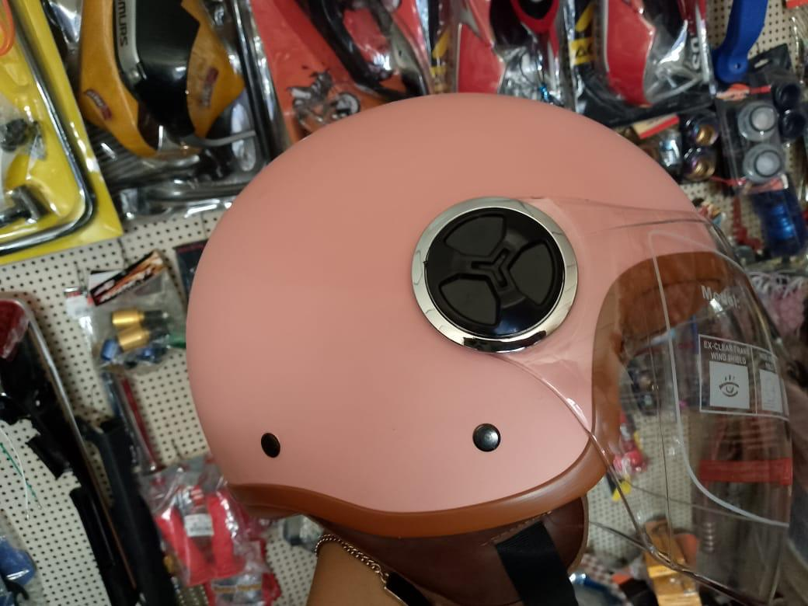
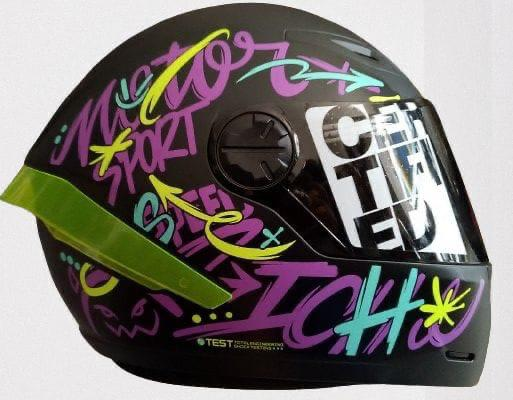
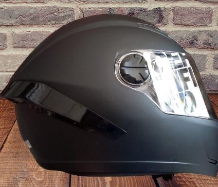
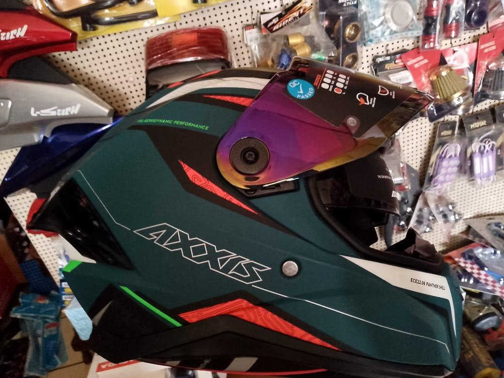

# web-0002-shir-

<html lang="es">
<head>
    <meta charset="UTF-8">
    <meta name="viewport" content="width=device-width, initial-scale=1.0">
    <title>Catálogo de Fotos</title>
    
</head>
<body>
    <h1></h1>
    

        

            
            <h3>Nombre del Producto 1</h3>
            
Descripción breve del producto 1.

        

        

            
            <h3>Nombre del Producto 2</h3>
            
Descripción breve del producto 2.

        

        

            
            <h3>Nombre del Producto 3</h3>
            
Descripción breve del producto 3.

        

   

        

            
            <h3>Nombre del Producto 3</h3>
            
Descripción breve del producto 3.

        

        
        <!-- Añade más elementos de catálogo aquí -->
    

</body>
</html>

<html lang="es">
<head>
    <meta charset="UTF-8">
    <meta name="viewport" content="width=device-width, initial-scale=1.0">
    
</head>
<body>
    <h1></h1>
</body>
</html>

<!DOCTYPE html>
<html lang="es">
<head>
    <meta charset="UTF-8">
    <meta name="viewport" content="width=device-width, initial-scale=1.0">
    <title>Botón en HTML</title>
    
</head>
<body>
    <button class="https://ice20026.github.io/web-001-shir/">atras</button>
</body>
</html>
